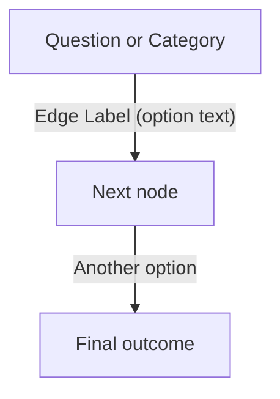

# [WIP] Weapons Classification Assistant

An interactive tool to assist in classifying Small Arms based on the **ARES Arms & Munitions Classification System (ARCS)** and the **SAS Weapons Identification Guide**.

This tool guides users through a step-by-step visual taxonomy to classify an item down to its **type** (ARCS Levels 1–3), then provides guidance on how to proceed toward **identification** (determining make, model, and variant) (this part is coming soon!).


## Quick Start Workflow

This project uses a **GitHub-first** workflow with automatic HTML generation via GitHub Actions. No local setup required for editing!

### The Basic Flow

```
Edit Mermaid → Commit to branch → Preview on web → Create PR → Merge to main
```


## Project files

- `weapons-classification-flowchart.mmd`  
  Mermaid source for the decision flow (this is the file you edit).

Generated outputs (kept next to the `.mmd` at the repo root):

- `classification-guide.html`  
  Generated interactive click-through guide (the "start at the top" experience).
- `classification-guide-hypothesis-filtering.html`  
  Generated "start anywhere" hypothesis-filtering guide (menu-based; skip questions).

Generator scripts:

- `src/mermaid_to_clickthrough.py`  
  Generates `classification-guide.html`.
- `src/mermaid_to_hypothesis_filtering.py`  
  Generates `classification-guide-hypothesis-filtering.html`.

Optional:

- `mermaid.html`  
  A page for viewing the Mermaid diagram (if you use this in the repo).


## GitHub-first editing and previews (no local setup required)

This project is set up so you can make changes **directly on GitHub**, preview them on the web, and only then publish them to the main site.

### What is a "branch" and why do we use it?

A **branch** is basically a "safe workspace" for changes.

- When you create a branch, you get a copy of the project where you can experiment.
- Changes you make on your branch **do not affect the main site**.
- You'll get a **preview link** for your branch so you can see exactly what changed.
- When everything looks good, you merge your branch into `gh-pages` to publish to the main site.

Think of it like: "draft mode" → "preview" → "publish".


## Step-by-step: edit the Mermaid file on GitHub and preview it

### 1) Create your branch (your safe workspace)

1. Open this repo on GitHub.
2. Near the top-left of the file list, find the **branch dropdown** (it often shows the current branch name, like `gh-pages`).
3. Click the dropdown.
4. Type a new branch name (example: `diagram-fixes`).
5. Click the option that says **Create branch: `diagram-fixes`**.

You are now "on your branch." Anything you do next will only affect your branch.


### 2) Open the Mermaid file and start editing

1. In the file list, click **`weapons-classification-flowchart.mmd`**.
2. Click the **pencil icon** (Edit) near the top-right of the file view.
3. Make your edits in the editor.

**Optional (nicer editing experience): Mermaid Live**
1. Go to `https://mermaid.live/edit`
2. Copy/paste the contents of `weapons-classification-flowchart.mmd` into Mermaid Live.
3. Edit and validate the diagram.
4. Copy the updated Mermaid text back into GitHub.


### 3) Click "Commit changes" (this saves your edits)

When you're done editing:

1. Scroll down to the **Commit changes** section.
2. You can leave the default message, or write something like: `Update decision flow`.
3. Make sure it is committing to **your branch** (it should be, unless you changed it).
4. Click the **Commit changes** button.

✅ This is the moment your changes are saved to your branch.


### 4) GitHub Actions regenerates the HTML automatically

After you commit, GitHub Actions will automatically:

- Parse your updated `weapons-classification-flowchart.mmd`
- Regenerate `classification-guide.html` (click-through version)
- Regenerate `classification-guide-hypothesis-filtering.html` (hypothesis-filtering version)
- Commit both updated HTML files back to your branch
- Publish a web preview for your branch

You don't have to run anything locally for this flow.

**Tip:** If you click the **Actions** tab on GitHub, you can watch the workflow run and see whether it succeeded.


### 5) Open your preview links (see your changes on the web)

Your branch preview will be available at:

- Click-through guide (start at the top):  
  `https://paigemoody.github.io/weapons_classification_resources.github.io/branch-preview/<your-branch-name>/classification-guide.html`

- Hypothesis-filtering guide (start anywhere):  
  `https://paigemoody.github.io/weapons_classification_resources.github.io/branch-preview/<your-branch-name>/classification-guide-hypothesis-filtering.html`

**Example:**

- `https://paigemoody.github.io/weapons_classification_resources.github.io/branch-preview/diagram-fixes/classification-guide.html`
- `https://paigemoody.github.io/weapons_classification_resources.github.io/branch-preview/diagram-fixes/classification-guide-hypothesis-filtering.html`

If your change was just committed, it may take a minute for GitHub Pages to show the update.


## Publishing your changes to the main site (merge into `gh-pages`)

When your preview looks good, you can publish it so everyone sees it on the main site.

### 6) Create a Pull Request (PR)

A Pull Request is a way to say: "I'm ready to move the changes from my branch into the main branch."

1. On GitHub, go to the **Pull requests** tab.
2. Click **New pull request**.
3. For "base", choose `gh-pages`.
4. For "compare", choose your branch (example: `diagram-fixes`).
5. Click **Create pull request**.

You can add a description explaining what changed and why.


### 7) Merge the Pull Request

When you're ready:

1. Click **Merge pull request**
2. Confirm the merge

That publishes the changes to the main site.

**Main site URLs:**

- Click-through guide:  
  `https://paigemoody.github.io/weapons_classification_resources.github.io/classification-guide.html`

- Hypothesis-filtering guide:  
  `https://paigemoody.github.io/weapons_classification_resources.github.io/classification-guide-hypothesis-filtering.html`

**Note:** Because `gh-pages` is deployed from the branch, GitHub Pages may deploy twice:
- Once for the merge commit
- Once for the follow-up commit that updates the generated HTML files

This is expected with the current setup.


## Local development (optional)

If you want to iterate locally (faster feedback, easier editing), you can.

### Prerequisites

This dev container comes with everything pre-installed:

- **Python 3** and `pip3` on the `PATH`
- **Git** (built from source) on the `PATH`
- **Node.js**, `npm`, and `eslint` on the `PATH`
- **Standard Unix utilities:** `curl`, `wget`, `grep`, `zip`, `tar`, `gzip`, etc.

The environment is **Debian GNU/Linux 12 (bookworm)**.

### Generate the HTML files

From the repo root:

```bash
python3 src/mermaid_to_clickthrough.py \
  --input-mmd weapons-classification-flowchart.mmd \
  --output-html classification-guide.html \
  --app-name "[DEMO] Weapons Classification Guide"
```

```bash
python3 src/mermaid_to_hypothesis_filtering.py \
  --input-mmd weapons-classification-flowchart.mmd \
  --output-html classification-guide-hypothesis-filtering.html \
  --app-name "[DEMO] Weapons Classification Guide (Hypothesis Filtering)"
```

### Preview locally

Start a simple HTTP server from the repo root:

```bash
python3 -m http.server 8000
```

Then open these URLs in your browser:

```bash
"$BROWSER" http://localhost:8000/classification-guide.html
"$BROWSER" http://localhost:8000/classification-guide-hypothesis-filtering.html
```

### Using the dev container

This project includes a dev container configuration ([`.devcontainer/devcontainer.json`](.devcontainer/devcontainer.json)) with all necessary tools pre-installed.

To use it:

1. Open the project in VS Code
2. When prompted, click **Reopen in Container** or use the Command Palette (`Ctrl+Shift+P` → "Dev Containers: Reopen in Container")
3. Run the generation commands above from the terminal

All tools (Python, Node.js, Git, standard Unix utilities) are immediately available in the container terminal.


## Understanding the generator scripts

### [`mermaid_to_clickthrough.py`](src/mermaid_to_clickthrough.py)

Converts the Mermaid flowchart into a **click-through guide** where users:
- Start at the top (root node)
- Answer questions in sequence
- Navigate forward/backward with breadcrumbs

**Features:**
- Parses Mermaid syntax (nodes and edges with labels)
- Supports rich HTML labels (including images)
- Detects cycles and prevents infinite loops
- Generates a React app embedded in a single HTML file

### [`mermaid_to_hypothesis_filtering.py`](src/mermaid_to_hypothesis_filtering.py)

Converts the Mermaid flowchart into a **hypothesis-filtering guide** where users:
- Start anywhere (menu-based question list)
- Skip questions they can't answer
- See a ranked list of possible outcomes (hypotheses)
- Answers are hard constraints (contradictions are blocked)

**Features:**
- Builds a question-option model from the Mermaid tree
- Computes leaf outcomes and depth ranking
- Maps options to leaf sets for filtering
- Prevents users from eliminating all possibilities
- Generates a React app embedded in a single HTML file

## Mermaid syntax reference

The flowchart uses a simple Mermaid syntax:



**Key points:**

- Node IDs: alphanumeric + underscores (e.g., `Handguns_Rifled`)
- Node labels: enclosed in `["..."]` with optional HTML
- Edge labels: after `-->` as `|"..."|` with optional HTML
- Both node and edge labels support: `<h1>`, `<p>`, ``, `<br />`, etc.

**Example with images:**

```mermaid
QuestionNode["<h1>Which barrel type?</h1><p>Look at the grooves</p>"]
QuestionNode --> |"<h1>Rifled</h1>"| RifledNode
```

## Troubleshooting

### GitHub Actions workflow failed

1. Go to the **Actions** tab on GitHub
2. Click the failed workflow run
3. Check the logs for error messages (usually parsing or file path issues)

### HTML files are not regenerating

- Make sure you committed to your **branch** (not directly to `gh-pages`)
- Check that the workflow is enabled (Settings → Actions)
- Wait a minute and refresh the page (GitHub Actions can take time)

### Preview links are 404

- Check that your branch name is correct
- Wait a few minutes for GitHub Pages to deploy
- Verify the branch was pushed to GitHub

### Local generation fails

- Ensure Python 3 is installed: `python3 --version`
- Check file paths are correct (run commands from repo root)
- Verify `.mmd` file is valid Mermaid syntax

## Contributing

1. Create a branch for your changes
2. Edit [`weapons-classification-flowchart.mmd`](weapons-classification-flowchart.mmd)
3. Commit and push to your branch
4. Preview the changes on your branch preview links
5. Create a Pull Request
6. Get feedback and merge when ready
