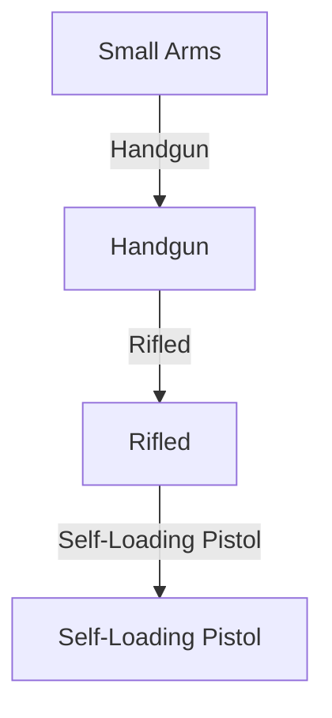

# [WIP] Weapons Classification Assistant

An interactive tool to assist in classifying Small Arms based on the **ARES Arms & Munitions Classification System (ARCS)** and the **SAS Weapons Identification Guide**.

This tool guides users through a step-by-step visual taxonomy to classify an item down to its **type** (ARCS Levels 1–3), then provides guidance on how to proceed toward **identification** (determining make, model, and variant) (this part is coming soon!).


## Quick Start Workflow

This project uses a **GitHub-first** workflow with automatic HTML generation via GitHub Actions. No local setup required for editing!

### The New Flow: JSON-Based Taxonomy

```
Edit taxonomy.json (on GitHub)
  → Commit to branch
  → GitHub Actions:
     1. Validates taxonomy.json
     2. Generates Mermaid from JSON
     3. Generates HTML from Mermaid
  → Preview on web
  → Create PR & Merge to publish
```

**Key benefit:** Edit structured data, not diagram syntax. Images, attributes, and hierarchy are validated automatically.


## Project files

### Source (what you edit)

- **`taxonomy.json`** ← **Edit this file**  
  Structured classification data with images, attributes, and ARCS hierarchy. All changes here trigger automatic validation and regeneration.

### Auto-generated (don't edit directly)

- **`weapons-classification-flowchart.mmd`**  
  Mermaid flowchart generated from `taxonomy.json`. Regenerated automatically when taxonomy changes.

- **`classification-guide.html`**  
  Interactive click-through guide (the "start at the top" experience). Regenerated from `.mmd`.

- **`classification-guide-hypothesis-filtering.html`**  
  "Start anywhere" hypothesis-filtering guide (menu-based; skip questions). Regenerated from `.mmd`.

### Generator scripts

- **`src/taxonomy_validator.py`**  
  Validates `taxonomy.json` structure, image paths, required fields, and enforces schema compliance.

- **`src/taxonomy_to_mermaid.py`**  
  Converts `taxonomy.json` → `weapons-classification-flowchart.mmd`.

- **`src/mermaid_to_clickthrough.py`**  
  Generates `classification-guide.html` (click-through version).

- **`src/mermaid_to_hypothesis_filtering.py`**  
  Generates `classification-guide-hypothesis-filtering.html` (hypothesis-filtering version).

### Documentation

- **[`TAXONOMY_EDITING_GUIDE.md`](TAXONOMY_EDITING_GUIDE.md)**  
  Step-by-step instructions for editing the taxonomy, organizing images, and previewing changes.


## Understanding the taxonomy.json structure

The `taxonomy.json` file is the **single source of truth** for your classification system.

### File organization

All images must be PNGs organized by source:

```
sources/
├── ARES_arms_munitions_classification_system/
│   └── visuals/
│       ├── Figure2.8_Typical_parts_breakopen_handgun.png
│       ├── Figure2.12_Revolvers.png
│       ├── Figure2.13_SelfLoading_Pistols.png
│       └── ...
└── small_arms_survey/
    └── visuals/
        ├── Figure_3.1_Typical_features_of_a_modern_military_rifle.png
        ├── Figure_3.2_Typical_features_of_a_modern_handgun.png
        └── ...
```

### Taxonomy structure

Each classification in `taxonomy.json` contains:

```json
{
  "id": "handgun_rifled_self_loading_pistol",
  "name": "Self-Loading Pistol",
  "arcs_levels": {
    "level_1": "Small Arms",
    "level_2": "Handgun",
    "level_3": "Rifled",
    "level_4": "Self-Loading Pistol"
  },
  "attributes": {
    "weapon_category": "Handgun",
    "barrel_type": "Rifled",
    "action_type": "Self-Loading",
    "magazine_fed": true,
    "intended_use": "Self-Defense"
  },
  "description": "A self-loading pistol with a rifled barrel that fires one round per trigger pull...",
  "images": [
    {
      "source_name": "ARES_arms_munitions_classification_system",
      "filename": "Figure2.13_SelfLoading_Pistols.png",
      "caption": "Self-Loading Pistol Examples",
      "alt_text": "Typical features of a modern self-loading pistol"
    }
  ]
}
```

**Required fields per classification:**
- `id` (string, unique): lowercase with underscores
- `name` (string): display name using full terminology
- `arcs_levels` (object): level_1, level_2, level_3, level_4 (all required strings)
- `attributes` (object): weapon characteristics (flexible key-value pairs)
- `description` (string): 1–2 sentence explanation
- `images` (array): list of image objects with source_name, filename, caption, alt_text

**Schema validation:** The validator enforces strict schema compliance and rejects unknown fields.


## GitHub-first editing and previews (no local setup required)

This project is set up so you can make changes **directly on GitHub**, preview them on the web, and only then publish them to the main site.

### What is a "branch" and why do we use it?

A **branch** is basically a "safe workspace" for changes.

- When you create a branch, you get a copy of the project where you can experiment.
- Changes you make on your branch **do not affect the main site**.
- You'll get a **preview link** for your branch so you can see exactly what changed.
- When everything looks good, you merge your branch into `gh-pages` to publish to the main site.

Think of it like: "draft mode" → "preview" → "publish".


## Step-by-step: edit taxonomy.json on GitHub and preview it

### 1) Create your branch (your safe workspace)

1. Open this repo on GitHub
2. Near the top-left of the file list, find the **branch dropdown** (it often shows the current branch name, like `gh-pages`)
3. Click the dropdown
4. Type a new branch name (example: `add-shotgun-classifications`)
5. Click **Create branch: `add-shotgun-classifications`**

You are now "on your branch." Anything you do next will only affect your branch.


### 2) Open taxonomy.json and start editing

1. In the file list, click **`taxonomy.json`**
2. Click the **pencil icon** (Edit) near the top-right of the file view
3. Make your edits in the JSON editor

**What to edit:**
- Add new classifications to the `classifications` array
- Edit existing classifications (attributes, images, descriptions)
- Follow the JSON schema strictly (no unknown fields allowed)

**Tips:**
- Use full terminology: "Self-Loading" not "Semi-Auto"
- Make sure image filenames match exactly (case-sensitive)
- Verify image paths exist: `sources/<source_name>/visuals/<filename>.png`
- Keep `arcs_levels` structure with all four levels (level_1 through level_4)

See **[`TAXONOMY_EDITING_GUIDE.md`](TAXONOMY_EDITING_GUIDE.md)** for detailed examples and best practices.


### 3) Commit your changes (this saves your edits)

When you're done editing:

1. Scroll down to the **Commit changes** section
2. Write a descriptive message (example: `Add bolt-action rifle classification with images`)
3. Make sure it is committing to **your branch** (it should be, unless you changed it)
4. Click **Commit changes**

✅ Your changes are now saved to your branch.


### 4) GitHub Actions validates and regenerates automatically

After you commit, GitHub Actions will automatically:

1. **Validate** `taxonomy.json` for schema compliance and image paths
2. **Generate** `weapons-classification-flowchart.mmd` from the taxonomy
3. **Generate** both HTML guides from the Mermaid
4. **Commit** all generated files back to your branch
5. **Publish** a web preview for your branch

You don't have to run anything locally for this flow.

**Check the workflow status:**
- Click the **Actions** tab on GitHub
- Look for your workflow run
- If validation fails, click the run to see error details
- Fix issues and push again

**Workflow success indicators:**
- ✅ Taxonomy is valid
- ✅ Mermaid generated successfully
- ✅ HTML guides regenerated
- ✅ Files committed to your branch
- ✅ Preview links are live


### 5) Open your preview links (see your changes on the web)

Your branch preview will be available at:

**Click-through guide** (start at the top):
```
https://paigemoody.github.io/weapons_classification_resources.github.io/branch-preview/<your-branch-name>/classification-guide.html
```

**Hypothesis-filtering guide** (start anywhere):
```
https://paigemoody.github.io/weapons_classification_resources.github.io/branch-preview/<your-branch-name>/classification-guide-hypothesis-filtering.html
```

**Example** (if your branch is `add-shotgun-classifications`):
- `https://paigemoody.github.io/weapons_classification_resources.github.io/branch-preview/add-shotgun-classifications/classification-guide.html`
- `https://paigemoody.github.io/weapons_classification_resources.github.io/branch-preview/add-shotgun-classifications/classification-guide-hypothesis-filtering.html`

If your change was just committed, it may take a minute for GitHub Pages to show the update. Refresh the page if needed.


## Publishing your changes to the main site (merge into `gh-pages`)

When your preview looks good, you can publish it so everyone sees it on the main site.

### 6) Create a Pull Request (PR)

A Pull Request is a way to say: "I'm ready to move the changes from my branch into the main branch."

1. On GitHub, go to the **Pull requests** tab
2. Click **New pull request**
3. For "base", choose `gh-pages`
4. For "compare", choose your branch (example: `add-shotgun-classifications`)
5. Click **Create pull request**

You can add a description explaining what changed and why (e.g., "Added 3 new shotgun classifications with reference images").


### 7) Merge the Pull Request

When you're ready:

1. Click **Merge pull request**
2. Confirm the merge

That publishes the changes to the main site.

**Main site URLs:**

- Click-through guide:  
  `https://paigemoody.github.io/weapons_classification_resources.github.io/classification-guide.html`

- Hypothesis-filtering guide:  
  `https://paigemoody.github.io/weapons_classification_resources.github.io/classification-guide-hypothesis-filtering.html`

**Note:** Because `gh-pages` is deployed from the branch, GitHub Pages may deploy twice:
- Once for the merge commit
- Once for the follow-up commit that updates the generated files

This is expected with the current setup.


## Local development (optional)

If you want to iterate locally (faster feedback, easier editing), you can.

### Prerequisites

This dev container comes with everything pre-installed:

- **Python 3** and `pip3` on the `PATH`
- **Git** (built from source) on the `PATH`
- **Node.js**, `npm`, and `eslint` on the `PATH`
- **Standard Unix utilities:** `curl`, `wget`, `grep`, `zip`, `tar`, `gzip`, etc.

The environment is **Debian GNU/Linux 12 (bookworm)**.

### Validate the taxonomy locally

Before committing, validate your `taxonomy.json` to catch errors early:

```bash
python3 src/taxonomy_validator.py validate taxonomy.json
```

**Output:**
- ✅ If valid: `Taxonomy is valid (N classifications)`
- ❌ If invalid: Lists all schema errors, missing files, and unknown fields

### Generate Mermaid from taxonomy

```bash
python3 src/taxonomy_to_mermaid.py \
  --input-json taxonomy.json \
  --output-mmd weapons-classification-flowchart.mmd
```

### Generate the HTML files from Mermaid

```bash
python3 src/mermaid_to_clickthrough.py \
  --input-mmd weapons-classification-flowchart.mmd \
  --output-html classification-guide.html \
  --app-name "[DEMO] Weapons Classification Guide"
```

```bash
python3 src/mermaid_to_hypothesis_filtering.py \
  --input-mmd weapons-classification-flowchart.mmd \
  --output-html classification-guide-hypothesis-filtering.html \
  --app-name "[DEMO] Weapons Classification Guide (Hypothesis Filtering)"
```

### Full local workflow (one-line shortcut)

Validate, generate Mermaid, and generate both HTML files:

```bash
python3 src/taxonomy_validator.py validate taxonomy.json && \
python3 src/taxonomy_to_mermaid.py --input-json taxonomy.json --output-mmd weapons-classification-flowchart.mmd && \
python3 src/mermaid_to_clickthrough.py --input-mmd weapons-classification-flowchart.mmd --output-html classification-guide.html --app-name "[DEMO] Weapons Classification Guide" && \
python3 src/mermaid_to_hypothesis_filtering.py --input-mmd weapons-classification-flowchart.mmd --output-html classification-guide-hypothesis-filtering.html --app-name "[DEMO] Weapons Classification Guide (Hypothesis Filtering)"
```

### Preview locally

Start a simple HTTP server from the repo root:

```bash
python3 -m http.server 8000
```

Then open these URLs in your browser:

```bash
"$BROWSER" http://localhost:8000/classification-guide.html
"$BROWSER" http://localhost:8000/classification-guide-hypothesis-filtering.html
```

### Using the dev container

This project includes a dev container configuration ([`.devcontainer/devcontainer.json`](.devcontainer/devcontainer.json)) with all necessary tools pre-installed.

To use it:

1. Open the project in VS Code
2. When prompted, click **Reopen in Container** or use the Command Palette (`Ctrl+Shift+P` → "Dev Containers: Reopen in Container")
3. Run any of the commands above from the terminal

All tools (Python, Node.js, Git, standard Unix utilities) are immediately available in the container terminal.


## Understanding the generator scripts

### [`taxonomy_validator.py`](src/taxonomy_validator.py)

Validates `taxonomy.json` for:
- **Schema compliance:** All required fields present, correct types
- **No unknown fields:** Rejects extra keys that don't match the schema
- **Image integrity:** All referenced PNG files exist in the correct paths
- **ID uniqueness:** No duplicate classification IDs
- **ARCS hierarchy:** All four levels present and non-empty

**Usage:**
```bash
python3 src/taxonomy_validator.py validate taxonomy.json
python3 src/taxonomy_validator.py list taxonomy.json
```

### [`taxonomy_to_mermaid.py`](src/taxonomy_to_mermaid.py)

Converts `taxonomy.json` → `weapons-classification-flowchart.mmd`.

Builds a Mermaid flowchart from the ARCS hierarchy in your classifications:
- Extracts all level_1 → level_2 → level_3 → level_4 paths
- Creates nodes and edges for each path
- Generates valid Mermaid syntax for visualization

**Usage:**
```bash
python3 src/taxonomy_to_mermaid.py \
  --input-json taxonomy.json \
  --output-mmd weapons-classification-flowchart.mmd
```

### [`mermaid_to_clickthrough.py`](src/mermaid_to_clickthrough.py)

Converts the Mermaid flowchart into a **click-through guide** where users:
- Start at the top (root node)
- Answer questions in sequence
- Navigate forward/backward with breadcrumbs
- See images and descriptions for each classification

**Features:**
- Parses Mermaid syntax (nodes and edges with labels)
- Supports rich HTML labels (including images)
- Detects cycles and prevents infinite loops
- Generates a React app embedded in a single HTML file

**Usage:**
```bash
python3 src/mermaid_to_clickthrough.py \
  --input-mmd weapons-classification-flowchart.mmd \
  --output-html classification-guide.html \
  --app-name "Weapons Classification Guide"
```

### [`mermaid_to_hypothesis_filtering.py`](src/mermaid_to_hypothesis_filtering.py)

Converts the Mermaid flowchart into a **hypothesis-filtering guide** where users:
- Start anywhere (menu-based question list)
- Skip questions they can't answer
- See a ranked list of possible outcomes (hypotheses)
- Answers are hard constraints (contradictions are blocked)

**Features:**
- Builds a question-option model from the Mermaid tree
- Computes leaf outcomes and depth ranking
- Maps options to leaf sets for filtering
- Prevents users from eliminating all possibilities
- Generates a React app embedded in a single HTML file

**Usage:**
```bash
python3 src/mermaid_to_hypothesis_filtering.py \
  --input-mmd weapons-classification-flowchart.mmd \
  --output-html classification-guide-hypothesis-filtering.html \
  --app-name "Weapons Classification Guide (Hypothesis Filtering)"
```

## Mermaid syntax reference

The flowchart is **auto-generated** from `taxonomy.json`, but understanding the Mermaid structure helps when reviewing or debugging.



**Key points:**

- Node IDs: alphanumeric + underscores (e.g., `small_arms`, `handgun_rifled`)
- Node labels: enclosed in `["..."]` with optional HTML
- Edge labels: after `-->` as `|"..."|` with optional HTML
- Both node and edge labels support: `<h1>`, `<p>`, ``, `<br />`, etc.

The taxonomy hierarchy maps directly to Mermaid paths:
```
level_1 → level_2 → level_3 → level_4
   ↓        ↓         ↓         ↓
 node    →  node   →  node   → node
```

## Troubleshooting

### GitHub Actions workflow failed

1. Go to the **Actions** tab on GitHub
2. Click the failed workflow run
3. Check the logs for error messages:
   - **"Taxonomy validation failed"** → Check error details, fix `taxonomy.json`
   - **"Image not found"** → Verify image paths and filenames
   - **"Unknown field"** → Remove unrecognized JSON keys
   - **"Duplicate ID"** → Check for duplicate classification IDs

4. Fix the issue in `taxonomy.json` and push again

### Validation fails locally

Run the validator to see detailed errors:

```bash
python3 src/taxonomy_validator.py validate taxonomy.json
```

Common issues:
- **Missing required field:** Add the field to all classifications
- **Wrong type:** Check if value should be string, boolean, object, or array
- **Unknown field:** Remove unrecognized keys (schema is strict)
- **Missing image file:** Check `sources/<source_name>/visuals/<filename>.png` path

### HTML files are not regenerating

- Make sure you committed to your **branch** (not directly to `gh-pages`)
- Check that the workflow is enabled (Settings → Actions)
- Wait a minute and refresh the page (GitHub Actions can take time)

### Preview links are 404

- Check that your branch name is correct
- Wait a few minutes for GitHub Pages to deploy
- Verify the branch was pushed to GitHub

### Local generation fails

- Ensure Python 3 is installed: `python3 --version`
- Check file paths are correct (run commands from repo root)
- Verify `.json` file is valid JSON: `python3 -m json.tool taxonomy.json`
- Run the validator: `python3 src/taxonomy_validator.py validate taxonomy.json`
